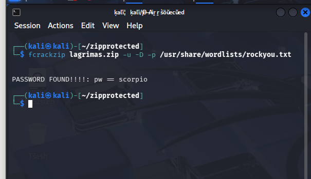
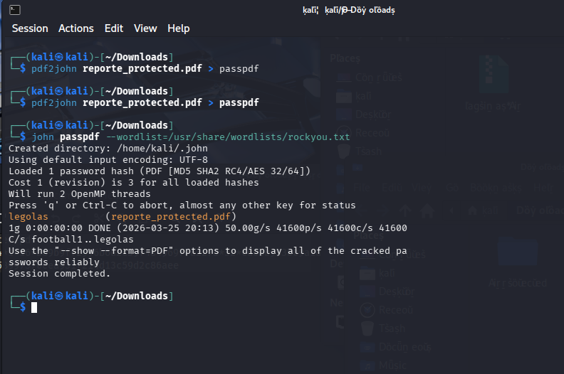
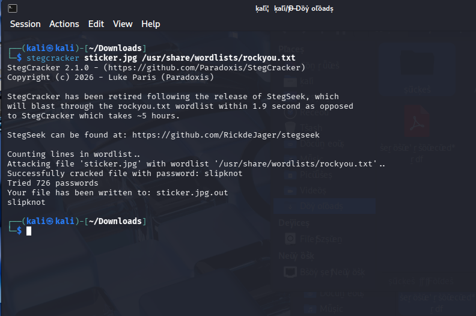
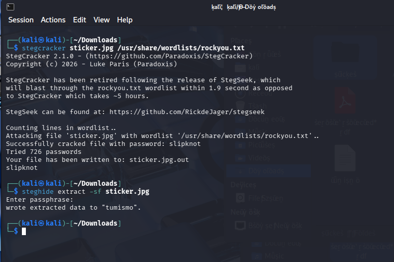
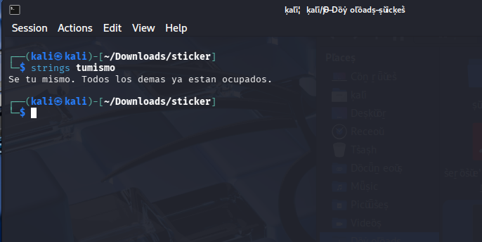
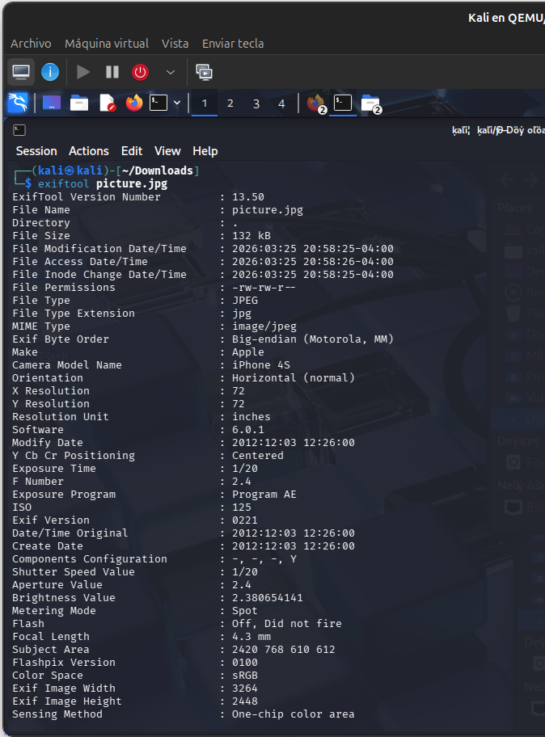

# 🔍 Taller de Forense Digital – Kali Linux

## 👨‍💻 Autor

* Carlos Pinto
* Esteban Saldaña

---

## 📌 Descripción

Este proyecto corresponde a un laboratorio de **forense digital**, donde se aplicaron técnicas de análisis de archivos, recuperación de contraseñas y detección de información oculta utilizando herramientas de Kali Linux.

---

## 🛠️ Herramientas utilizadas

* John the Ripper
* fcrackzip
* Steghide
* Stegcracker
* Exiftool
* Binwalk
* Strings

---

## 🔐 1. Crackeo de archivos protegidos

Se realizó la recuperación de contraseñas utilizando ataques de diccionario con `rockyou.txt`.

### 📦 ZIP

* Herramienta: fcrackzip
* Resultado: contraseña recuperada ✔️

### 📄 PDF

* Herramientas: pdf2john + john
* Resultado: acceso al contenido protegido ✔️

---

## 🕵️ 2. Esteganografía

Se identificó y extrajo información oculta dentro de una imagen.

* Contraseña encontrada: `slipknot`
* Archivo extraído: `tumismo`
* Mensaje oculto:

> "Se tu mismo. Todos los demas ya estan ocupados."

---

## 🧬 3. Análisis forense

* El archivo analizado correspondía a una imagen JPEG válida
* No se detectaron datos incrustados con binwalk
* Se confirmó el uso de esteganografía

---

## 📍 4. Metadatos

* 📅 Fecha: 03-12-2012
* 📱 Dispositivo: iPhone 4S
* 📍 Ubicación: Copán, Honduras

---

## 🧠 Conclusión

Este laboratorio demuestra cómo técnicas como la esteganografía y el uso de contraseñas débiles pueden comprometer la seguridad de la información. Además, resalta la importancia del análisis de metadatos en investigaciones forenses.

---

## 📸 Evidencias

---

## 🚀 Habilidades demostradas

* Análisis forense digital
* Uso de Kali Linux
* Cracking de contraseñas
* Esteganografía
* Interpretación de metadatos

---
